# Demystify ✨

**A Submission for the Google Gen AI Hackathon by Team `404 Raita Not Found`**

---

Demystify is an AI-powered suite of tools designed to bring clarity and confidence to everyone who has ever been intimidated by a complex document. We tackle the dense jargon and information asymmetry in legal and official texts, transforming them into simple, actionable insights.

[](https://ai.google.dev/)

### **[View Live Demo](https://your-deployment-link.vercel.app/)** 🚀

---

## 🎯 Key Features

-   **📄 Document Demystifier**: Upload any document (TXT, PDF, JPG) to get a plain-English summary, a risk score, a list of "red flags" with AI-suggested rewrites, a timeline of key dates, and a jargon buster.
-   **✍️ Contract Drafter**: Generate professional documents like Leases, NDAs, and Freelance Agreements from user-friendly templates and forms.
-   **🌐 Document Translator**: Instantly translate the content of uploaded documents into over 20 languages.
-   **⚖️ Document Comparison**: Compare two versions of a document side-by-side to instantly highlight differences, new risks, and missing clauses.
-   **🧭 Document Guide**: A conversational AI to get step-by-step guidance on official procedures (e.g., "How do I get a passport?").
-   **🔐 Full User Authentication**: Secure user registration and login powered by **Supabase**.
-   **🗂️ Persistent History**: Automatically saves your analysis results, drafts, and conversations to your secure account for future reference.
-   **🌗 Light/Dark Mode**: A sleek, modern UI with a theme toggle for user comfort.

---

## 🏗️ System Architecture

Demystify is built on a modern, serverless architecture that prioritizes security, scalability, and a fast user experience. The frontend application communicates directly with our BaaS provider (Supabase) for data and our AI provider (Google Gemini) for intelligence.

```mermaid
flowchart TD
    subgraph User
        A[Browser]
    end

    subgraph Hosting
        B(React SPA - Vite/Tailwind)
    end

    subgraph Backend Services
        C(Supabase - Auth & PostgreSQL)
        D(Google Gemini API)
    end

    A -- Loads App --> B
    B -- Auth & History API Calls --> C
    B -- AI Analysis & Generation API Calls --> D

    style A fill:#2d3748,stroke:#cbd5e0,stroke-width:2px
    style B fill:#4a5568,stroke:#cbd5e0,stroke-width:2px
    style C fill:#38A169,stroke:#fff,stroke-width:2px
    style D fill:#4285F4,stroke:#fff,stroke-width:2px
```



### **Component Breakdown:**

1.  **Client (React SPA):**
    *   The user interface is a fast and responsive Single-Page Application built with **React** and **Vite**.
    *   Styling is handled by **Tailwind CSS** for a modern, consistent look and feel.
    *   All user interactions, state management, and API calls originate from the client.

2.  **Backend-as-a-Service (Supabase):**
    *   We use Supabase for all backend needs, eliminating the need for a traditional server.
    *   **Authentication:** Manages user sign-up, login, and sessions securely.
    *   **Database (PostgreSQL):** Stores user-specific data, primarily the `history` of their analyses, drafts, and conversations. Row Level Security is enabled to ensure users can only access their own data.

3.  **AI Engine (Google Gemini API):**
    *   This is the core intelligence layer of the application. The React app makes direct, secure HTTPS calls to the Gemini API.
    *   We use the `gemini-2.5-flash` model for its excellent balance of speed, cost-effectiveness, and capability, ensuring all features are accessible within the free tier.
    *   It powers every intelligent feature, from document analysis and risk assessment to contract drafting and translation.

---

## 🛠️ Tech Stack

-   **Frontend:** React, Vite, TypeScript, Tailwind CSS, Framer Motion
-   **AI Engine:** Google Gemini API (`@google/genai`)
-   **Backend & Database:** Supabase (Authentication & PostgreSQL)
-   **Deployment:** Vercel

---

## 🚀 Local Development Setup

Follow these steps to get the project running on your local machine.

### Prerequisites

-   [Node.js](https://nodejs.org/) (v18.x or later)
-   npm (included with Node.js)
-   A **Google Gemini API Key** from [Google AI Studio](https://aistudio.google.com/app/apikey).
-   A **Supabase** project. Create one for free at [supabase.com](https://supabase.com/).

### Step 1: Clone & Install

```bash
git clone <your-repository-url>
cd <repository-folder-name>
npm install
```

### Step 2: Configure Environment Variables

1.  Create a `.env` file in the project root by copying the `.env.example` file.
2.  Add your **Google Gemini API key**:
    ```env
    # .env
    API_KEY=YOUR_GEMINI_API_KEY_HERE
    ```
3.  Go to your Supabase project's **Settings > API** and find your **Project URL** and **anon (public) Key**.
4.  Add your **Supabase keys** to the `.env` file:
    ```env
    # .env
    VITE_SUPABASE_URL=YOUR_SUPABASE_PROJECT_URL_HERE
    VITE_SUPABASE_ANON_KEY=YOUR_SUPABASE_ANON_KEY_HERE
    ```

=
### Step 3: Run the App

```bash
npm run dev
```

The application will be available at `http://localhost:5173`.

---

## 🌐 Deployment

This project is configured for zero-hassle deployment on **Vercel**.

1.  Push your project to a Git provider (GitHub, GitLab).
2.  Import the repository into Vercel. It will be detected as a Vite project.
3.  Go to your project's **Settings > Environment Variables** and add your `API_KEY`, `VITE_SUPABASE_URL`, and `VITE_SUPABASE_ANON_KEY`.
4.  Deploy!

---

## 👨‍💻 Team

This project was brought to you by **Team 404 Raita Not Found**.
1.  Siddhant Yadav
2.  Hitesh Chandwani
3.  Rudraksh Moonga
4.  Linsha Bansal
